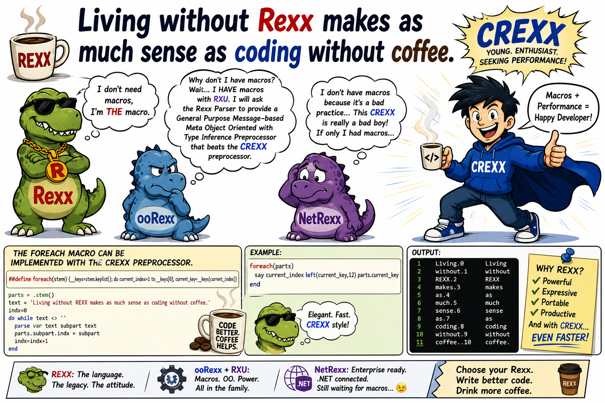

# Living without REXX makes as much sense as coding without coffee

Story and illustration by ChatGPT.  
This article was inspired by the following comment:  
[https://github.com/adesutherland/CREXX/issues/571#issuecomment-4572538762][need_coffee]  

Update: the CREXX committer changed the macro definition.  
The illustration still shows the old definition.  
The story has been updated with the new definition.



At 02:17 in the morning, the office coffee machine emitted a sound usually associated with dying spacecraft.

“Error 503,” it blinked.

Silence spread across the open-space development floor.

A dozen programmers stared at the machine with the same expression archaeologists reserve for cursed tombs.

Then panic began.

“Anybody got instant coffee?”

“No.”

“Energy drinks?”

“Only sugar-free kale flavor.”

A junior developer collapsed dramatically onto a bean bag.

And in the middle of the chaos sat Rexx.

Old. Relaxed. Wearing sunglasses indoors.

Rexx sipped calmly from a mug labeled:

> *I don’t need macros, I’m THE macro.*

Across the room, CREXX burst through the door like a startup pitch given human form.

Young hoodie. Fast sneakers. Laptop covered in compiler stickers.

“Good news!” shouted CREXX. “I added a FOREACH macro to the preprocessor!”

Nobody reacted.

One developer was trying to compile JavaScript by hand onto a whiteboard.

CREXX blinked.

“What happened here?”

ooRexx looked up from a pile of documentation and grumbled:

> “The coffee machine died.”

CREXX gasped.

NetRexx, pale and exhausted, whispered from the corner:

> “We tried coding without coffee…”

A terrible silence followed.

Even the servers seemed slower.

CREXX opened a terminal anyway.

“Fine,” he said. “We adapt.”

He typed furiously:

```rexx
##define cmd foreach(inkey inkw stem)  {__keys=stem.keylist(); do current_index=1 to __keys[0]; inkey=__keys[current_index]; /* inkw */}
```

The screen glowed.

The room leaned closer.

Rexx raised one eyebrow.

CREXX continued:

```rexx
foreach mykey IN parts
  say current_index left(mykey,12) parts.mykey
end
```

The output streamed perfectly.

Elegant. Fast. Beautiful.

For one glorious moment, the developers forgot the missing coffee.

A senior engineer wiped away a tear.

“It’s… readable.”

Another whispered:

“Is that preprocessing?”

A third fainted softly onto a pile of Ethernet cables.

But then the caffeine withdrawal returned.

One programmer tried to `PARSE VAR` a stapler.

Another attempted object-oriented design on a pizza box.

NetRexx stared sadly into the distance.

> “I don’t have macros because it’s a bad practice...”
>
> “This CREXX is really a bad boy.”
>
> “If only I had macros…”

ooRexx crossed its arms.

> “Why don’t I have macros? Wait… I *HAVE* macros with RXU.”
>
> “I will ask the Rexx Parser to provide a General Purpose Message-based Meta Object Oriented with Type Inference Preprocessor that beats the CREXX preprocessor.”

Nobody knew what that meant.

But everyone nodded respectfully.

Meanwhile, Rexx remained perfectly calm.

He stood up slowly, walked to the broken coffee machine, opened the side panel, and typed directly into its embedded controller:

```rexx
say "Percolating..."
```

The machine hummed.

Lights flickered.

Steam rose.

Coffee flowed once more.

The office erupted in cheers.

CREXX grinned.

NetRexx looked spiritually healed.

ooRexx immediately started designing an abstract coffee interface hierarchy.

And Rexx simply leaned back and smiled.

Because deep down, every programmer in that office understood the eternal truth:

> Living without Rexx makes as much sense as coding without coffee.


[need_coffee]: https://github.com/adesutherland/CREXX/issues/571#issuecomment-4572538762
