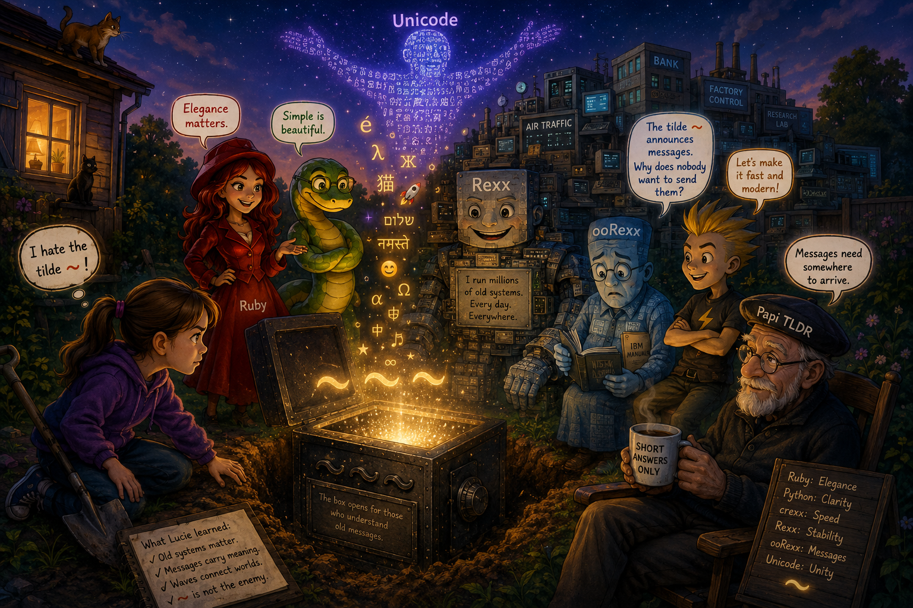

# Tilde waves become bridges

Story and illustration by ChatGPT.



## Grandpa Tilder, aka Papi TLDR

Lucie was digging angrily in the garden when the shovel struck metal.

**CLONG.**

She stopped immediately.

The evening wind moved through the tall grass behind the house, bending it into long rippling waves like giant green tildes.

Lucie hated tildes.

Especially this one:

`~`

It looked imprecise. Loose. Unstable.

Worst of all, her father and grandfather kept using it in terminal commands and strange old scripts as if it were completely normal.

Now, buried under the garden, she had discovered a black iron safe marked with three enormous engraved tildes:

`~~~`

— “Absolutely not,” Lucie muttered.

Behind her, sitting calmly in an old wooden chair with a steaming cup of tea, was her grandfather.

His name was Grandpa Tilder, but everyone called him Papi TLDR.

Because no matter how complicated the question was, he always answered with a one-sentence reply.

Just one.

And somehow this was even more irritating than the tildes.

Lucie pointed at the safe.

— “Why does this stupid symbol keep following me everywhere?”

Papi TLDR took a slow sip of tea.

— “Messages need somewhere to arrive.”

Lucie groaned.

— “That’s not an explanation.”

No response.

She cleaned the dirt off the safe and discovered a sentence engraved beneath the lock:

> “The box opens for those who understand old messages.”

She frowned.

— “That sounds ominous.”

She pulled the handle.

Locked.

She turned the dial.

Nothing.

She hit the side with the shovel.

Still nothing.

Then the wind rose again.

The grass rippled.  
The trees swayed.  
The clouds curved softly overhead.

For one strange moment, Lucie stopped seeing the tilde as decoration.

It looked more like…

a signal.

A wave moving from one place to another.

Slowly, suspiciously, she touched the engraved `~`.

The safe opened with a metallic click.

Blue light flooded the garden.

And from inside emerged six figures.

## The figures within

The first wore a crimson coat and spoke dramatically before either foot touched the ground.

— “At last,” she declared.
— “Fresh air and proper aesthetics.”

She bowed.

— “Ruby.”

Next came a tall green figure moving with calm precision.

— “Python,” he said quietly.
— “Please ignore Ruby’s entrances.”

— “Presentation matters,” Ruby replied immediately.

Then came a younger figure made of glowing compact syntax and impatient energy.

— “Finally,” he said.
— “Can we replace everything old now?”

He grinned sharply.

— “crexx.”

Lucie immediately liked him.

But behind crexx came two older figures.

The first was enormous.

Not flashy.

Not elegant.

But impossibly solid.

Its body was made of punch cards, terminals, bank systems, industrial consoles, dusty manuals, and millions upon millions of running scripts.

— “Rexx,” it said simply.

The garden fell strangely quiet.

Behind Rexx came a thinner figure carrying stacks of manuals and old IBM binders under one arm.

Its expression looked tired.

Nervous.

A little sad.

— “ooRexx,” he said softly.

## The tildes

Unlike Rexx, ooRexx kept glancing anxiously at the tildes engraved on the safe.

Lucie noticed immediately.

— “You hate them too?” she asked.

ooRexx looked surprised.

— “No,” he said quietly.  
— “I love them.”

He pointed carefully toward the floating `~` symbols.

— “They announce messages.”

Nobody spoke for a moment.

Then ooRexx continued:

— “A tilde means something is arriving. A signal. A transition. A conversation beginning.”

He looked down sadly.

— “But programmers keep avoiding them.”

crexx laughed loudly.

— “Because they’re weird.”

Ruby tilted her head.

Python crossed his arms thoughtfully.

ooRexx sighed.

— “Classic Rexx programmers built systems that talk to everything. Queues. Interfaces. Communication between machines.”  
— “But when I try to bring modern messaging, asynchronous events, signals…”  
He looked sadly at the tilde again.  
— “Everybody acts like the wave itself is the problem.”

Lucie blinked.

— “Wait. You’re upset because nobody likes your message tildes?”

ooRexx nodded quietly.

From behind them, Papi TLDR finally spoke.

— “Old programmers fear noisy messages.”

Lucie spun around dramatically.

— “CAN YOU PLEASE TALK LIKE A NORMAL HUMAN BEING FOR FIVE MINUTES?”

Papi TLDR shrugged.

— “Bandwidth matters.”

crexx burst out laughing.

Ruby covered her face.

Even Python smiled slightly.

## Waves become bridges

Then the safe began humming.

Thousands of glowing characters floated upward into the night sky:

`é λ Ж 猫 🚀 שלום नमस्ते`

Letters. Symbols. Emojis. Alphabets from every writing system imaginable.

And from within the storm of text appeared a gigantic shifting figure.

Unicode.

Its body continuously transformed between scripts, symbols, accents, and grapheme clusters.

Unicode looked first at Rexx.

Then ooRexx.

Then the tilde floating gently above the safe.

— “You misunderstand each other,” Unicode said softly.

ooRexx looked confused.

Unicode pointed toward Rexx.

Immediately the inside of the safe expanded impossibly deep.

Lucie could suddenly see millions of running systems:

* banks,
* factories,
* archives,
* research labs,
* government infrastructure.

Everywhere, Rexx scripts quietly continued doing their work.

Ancient.

Reliable.

Still alive.

Then Unicode pointed toward ooRexx.

Suddenly waves of messages appeared:

* asynchronous notifications,
* event streams,
* system signals,
* distributed queues,
* live communication between programs.

The floating tildes pulsed gently like radio transmissions.

Unicode spoke again.

— “Rexx carried the old world.”  
— “ooRexx tried to prepare the next one.”

Silence filled the garden.

crexx looked uncertain for the first time.

Ruby sat quietly in the grass.

Python stared thoughtfully at the floating message waves.

Lucie slowly turned toward her grandfather.

— “So why didn’t programmers follow ooRexx?”

Papi TLDR answered instantly.

— “Reliable silence beats chaotic chatter.”

ooRexx lowered his eyes.

Lucie finally understood.

The old programmers loved systems that stayed calm, predictable, quiet.

But ooRexx dreamed about systems constantly talking to each other.

Signals.

Messages.

Events.

Waves.

Tildes.

Not everybody wanted that future.

The wind moved softly through the garden again.

`~ ~ ~`

Lucie looked carefully at the floating symbol.

Not sloppy.

Not broken.

A wave carrying information from one place to another.

A harbinger of messages.

That night, Lucie stayed awake until sunrise.

Ruby helped make things elegant.  
Python made them understandable.  
crexx made them fast.  
Rexx made them stable.  
ooRexx taught them how systems could speak to each other.  
Unicode taught them how every character in every language could survive the journey.

And near dawn, Lucie wrote one final line onto the old terminal connected to the safe:

```rexx id="8v2f5z"
say "~ message received"
```

The tilde glowed softly.

ooRexx smiled for the first time all night.

Behind her, Papi TLDR finished his tea and quietly said:

— “Waves become bridges.”

And this time, finally, Lucie understood exactly what he meant.

## Different waves, same sea

Lucie looked around the glowing garden.

Ruby was arguing about elegance with crexx.  
Python was quietly reorganizing floating Unicode symbols into neat columns.  
ooRexx sat near the open safe, still staring sadly at the glowing tildes drifting through the air like message waves.

Rexx remained enormous and silent behind them all, carrying millions of invisible systems on its shoulders.

Lucie suddenly frowned.

She turned toward her grandfather.

— “Papi… why isn’t NetRexx in the safe?”

The garden became quiet.

Even Unicode seemed interested.

Papi TLDR slowly lowered his tea.

Then he answered:

— “Some children leave home.”

Lucie sighed dramatically.

— “Again with the tiny cryptic sentences.”

But ooRexx smiled softly this time.

He pointed upward.

Far above the garden, beyond the floating Unicode symbols, Lucie suddenly noticed something she had missed before.

Lines.

Long shining lines of light crossing the night sky like invisible threads between distant cities.

Networks.

Messages traveling everywhere at once.

And moving gracefully across those luminous paths was another figure.

Tall.

Fast.

Bright.

Made of Java classes, network packets, Unicode text, and old Rexx ideas transformed into something new.

NetRexx.

Unlike the others, NetRexx never touched the ground.

It moved through the air itself, surfing streams of messages across the glowing network lines.

Lucie watched in amazement.

— “Why is he up there?”

ooRexx answered quietly:

— “Because he was born for connected worlds.”

Ruby smiled knowingly.

Python nodded.

Even crexx looked impressed.

NetRexx waved as he passed overhead.

Behind him followed flowing streams of:

* distributed messages,
* internet protocols,
* Unicode text,
* JVM bytecode,
* old Rexx philosophy wrapped inside newer systems.

Lucie looked back at ooRexx.

— “So… NetRexx didn’t abandon Rexx?”

ooRexx seemed almost offended.

— “Of course not.”

Rexx finally spoke again, his deep voice sounding like old servers humming in hidden rooms.

— “Different waves. Same sea.”

Unicode shimmered brightly in approval.

Lucie crossed her arms.

— “So NetRexx isn’t inside the safe because he already escaped into the network?”

Papi TLDR smiled slightly.

— “The fastest messages never stay boxed.”

This time, nobody complained about the short answer.

## Meaning, not bytes

Lucie looked up again at Unicode, whose body shimmered with thousands of living scripts.

NetRexx was still gliding across the glowing network streams high above the garden.

Nearby, crexx sat on the edge of the safe with crossed arms, tapping impatient rhythms on the metal lid.

Lucie narrowed her eyes.

— “Unicode… NetRexx and crexx both claim to support you.”

Unicode nodded calmly.

— “They do.”

crexx grinned immediately.

NetRexx surfed lower through the sky and gave a theatrical bow.

Lucie continued:

— “But is it *really* true?”

Unicode’s glowing body shifted through alphabets slowly before answering.

— “Supporting Unicode is easy.”  
— “Supporting human text is hard.”

Papi TLDR murmured softly from his chair:

— “Everybody passes the demo.”

Lucie ignored him this time.

Unicode turned first toward NetRexx.

— “NetRexx inherited the JVM.”

NetRexx smiled proudly.

— “The entire Java ecosystem helps me.”

Unicode nodded.

— “That gives NetRexx enormous advantages.”

Suddenly the air filled with:

* normalization libraries,
* Unicode-aware rendering,
* internationalization APIs,
* network-safe text handling.

Lucie looked impressed.

— “So NetRexx is good with Unicode?”

Unicode answered carefully.

— “NetRexx is good at *accessing* Unicode.”

NetRexx stopped smiling slightly.

Lucie noticed immediately.

— “That sounded dangerously precise.”

Ruby quietly whispered:

— “Uh oh.”

Unicode continued:

— “But inherited power creates inherited complexity.”

The glowing network streams above the garden became tangled.

Thousands of layers appeared:

* UTF-16 internals,
* surrogate pairs,
* JVM abstractions,
* old Java assumptions,
* invisible conversions.

Then Unicode raised one glowing hand.

A single character appeared:

`𝄞`

The musical G-clef.

NetRexx confidently grabbed it.

Immediately dozens of invisible UTF-16 units exploded around him like broken glass.

Lucie jumped backward.

Python winced.

crexx laughed loudly.

Unicode spoke gently:

— “NetRexx often believes the platform already solved Unicode.”

NetRexx looked embarrassed.

— “Sometimes it mostly did.”

Unicode tilted his head.

— “Mostly.”

The floating fragments slowly reassembled.

Then Unicode turned toward crexx.

The air became sharp and fast.

Streams of optimized execution raced through the garden like lightning.

crexx smirked confidently.

— “No bloated virtual machine.”  
— “No giant framework.”  
— “No dependency jungle.”

Unicode nodded.

— “crexx respects simplicity.”

crexx crossed his arms proudly.

Unicode raised another glowing hand.

This time a family emoji appeared:

`👨‍👩‍👧‍👦`

crexx grabbed it confidently.

Immediately he froze.

The emoji unraveled into:

* multiple code points,
* zero-width joiners,
* grapheme clusters,
* modifier sequences.

crexx stared in horror.

— “That’s cheating.”

Python quietly replied:

— “No. That’s modern text.”

Unicode spoke softly.

— “crexx understands bytes extremely well.”
— “But human writing stopped fitting neatly into bytes long ago.”

crexx looked annoyed.

— “So you’re saying I’m too low-level?”

Unicode smiled gently.

— “I’m saying speed alone does not understand language.”

Silence drifted through the garden.

Lucie looked thoughtfully between them.

— “So NetRexx trusts giant abstractions too much…”

Unicode nodded.

— “…and crexx trusts raw simplicity too much.”

Unicode nodded again.

Ruby smiled quietly.

— “Classic engineering problem.”

Then Lucie turned toward ooRexx.

The old language was still sitting beside the glowing tildes.

— “What about you?”

ooRexx looked uncomfortable.

Unicode answered for him.

— “ooRexx understood early that messages matter.”  
— “Streams matter.”  
— “Events matter.”  
— “But…”

Lucie leaned forward.

Unicode sighed.

— “He arrived before the ecosystem was ready.”

ooRexx lowered his eyes sadly.

NetRexx floated silently above the garden.

crexx stopped joking for once.

Even Rexx seemed thoughtful.

Lucie looked upward at Unicode.

— “Then what would true Unicode support actually require?”

Unicode’s entire body brightened.

The stars themselves seemed to pulse.

Then he answered:

— “A language must understand that users do not type bytes.”  
— “They do not type code points.”  
— “They do not even type characters.”

Lucie whispered:

— “They type meaning.”

Unicode smiled.

— “Exactly.”

Papi TLDR finished the last sip of tea from his mug.

Then, without looking up, he delivered his final sentence of the night.

— “Unicode bugs begin where programmers stop imagining humans.”
